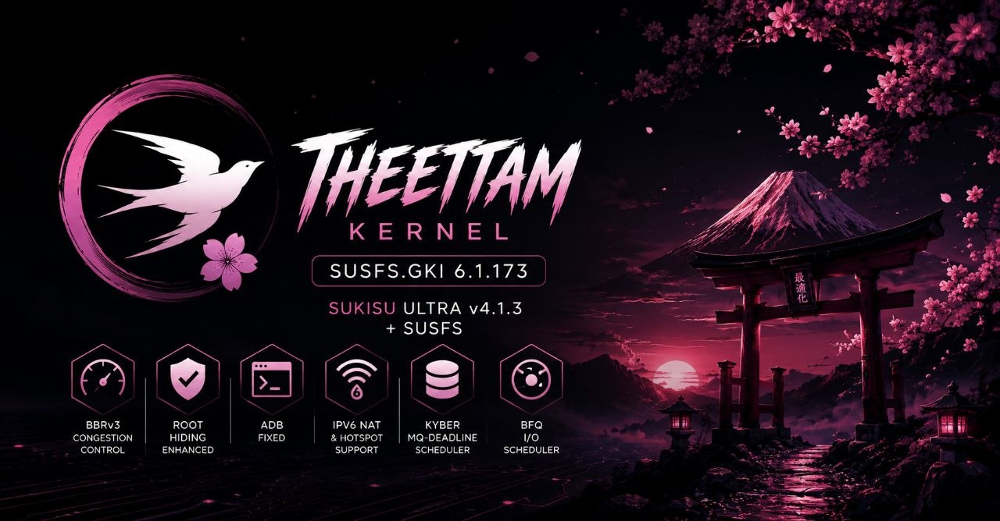

# Theettam Kernel

**Custom Android GKI kernel for the POCO F6 (peridot, Snapdragon 7 Gen 3 / sm8635)** — built on KernelSU **SukiSU Ultra** + **SUSFS** root hiding, with BBRv3 congestion control, deep root/LSPosed-hiding hardening, and battery/doze tuning on top.



A fork of **Chidori Kernel** by **GuidixX**, rebranded and continued as **Theettam Kernel** starting at `v1.0`.

[](https://github.com/Mohithash/kernel_xiaomi_sm8635/releases)
[](https://github.com/Mohithash/kernel_xiaomi_sm8635)
[](https://github.com/SukiSU-Ultra/SukiSU-Ultra)
[](https://gitlab.com/simonpunk/susfs4ksu)
[-purple)](https://github.com/Mohithash/kernel_xiaomi_sm8635)
[](LICENSE)

---

## Features

| | |
|---|---|
| **BBRv3 Congestion Control** | Full upstream BBR v2→v3 port (PLB, ECN-on-retransmit, per-route ECN-low) for better throughput/latency under loss |
| **Root Hiding, Enhanced** | SUSFS (sus_path/mount/kstat, uname & cmdline spoofing, open-redirect) + a zero-width-Unicode path-evasion fix SUSFS itself doesn't cover |
| **ADB Fixed** | Fixed a KernelSU bug where `adb root`'s `LD_PRELOAD`/`LD_LIBRARY_PATH` injection clobbered an app's own values instead of merging ([upstream PR #909](https://github.com/SukiSU-Ultra/SukiSU-Ultra/pull/909)) |
| **IPv6 NAT & Hotspot Support** | `IP6_NF_NAT`/`MASQUERADE` enabled alongside existing IPv4 NAT |
| **Kyber / mq-deadline Schedulers** | Added alongside BFQ for storage I/O scheduler choice |
| **BFQ I/O Scheduler** | Low-latency block I/O scheduling (existing, carried from base) |
| **LSPosed/Zygisk Hardening** | `BPF_LSM`, Yama ptrace restriction, `kptr_restrict=2`, `/proc/kallsyms` & `/proc/config.gz` exposure closed, SUSFS log trail silenced |
| **Battery & Doze Tuning** | Indefinite-wakelock timeout, reduced PCI PME wakeups, TCP slow-start-after-idle disabled for faster Doze-resume reconnects |
| **Forensic Hardening** | `init_on_free`, randomized per-syscall kernel stack offset |

See [CHANGELOG.md](CHANGELOG.md) for the full, detailed history of every change versus the GuidixX `16.2` base, including what was deliberately **not** included and why (Baseband Guard, LoadPin, TCP Brutal/BBR2 — all evaluated and rejected for concrete conflict reasons).

## Device support

| Device | Codename | Chipset | Status |
|---|---|---|---|
| POCO F6 | `peridot` | Snapdragon 7 Gen 3 (SM8635) | Primary target |

## Installation

1. Unlock your bootloader and have a custom recovery (TWRP/OrangeFox) or root solution already in place.
2. Download the latest zip from [Releases](https://github.com/Mohithash/kernel_xiaomi_sm8635/releases).
3. Flash via custom recovery, or `fastboot boot`/install-to-inactive-slot, following standard AnyKernel3 flashing flow.
4. Reboot.

**Pre-release builds are for testing — keep a backup and verify boot before relying on this as a daily driver.**

## Building from source

```bash
git clone --branch sukisu-ultra-susfs https://github.com/Mohithash/kernel_xiaomi_sm8635.git
cd kernel_xiaomi_sm8635
./build.sh
```

Produces a flashable AnyKernel3 zip in the repo root. Requires the Android Clang toolchain (auto-cloned by `build.sh` if missing).

## Credits

- [**GuidixX**](https://github.com/GuidixX) — original Chidori Kernel base this is forked from
- [**SukiSU-Ultra**](https://github.com/SukiSU-Ultra/SukiSU-Ultra) — KernelSU fork providing root
- [**simonpunk/susfs4ksu**](https://gitlab.com/simonpunk/susfs4ksu) — SUSFS root-hiding patches
- [**osm0sis**](https://github.com/osm0sis/AnyKernel3) — AnyKernel3 flashing framework

## Disclaimer

This is a custom kernel that modifies core system behavior, including root-hiding and security hardening. Flashing it is done at your own risk — back up your data first. Not affiliated with Xiaomi, Qualcomm, or Google.
