<div align="center">



<br>

[](../../releases/latest)
[](https://android.googlesource.com/kernel/common/+/refs/tags/android14-6.1.175_r00)
[](https://gitlab.com/simonpunk/susfs4ksu)
[](../../releases)
[](COPYING)
[](../../releases/latest)

**A custom GKI kernel for the Xiaomi `peridot` — POCO F6 / Redmi Turbo 3 (Snapdragon 8s Gen 3)**

Four root flavors. Pick the exact root + hiding stack you want.

</div>

---

##  Choose your build

<div align="center">

| Build | Root engine | SUSFS | KPM | Manager | Best for |
|:--|:--|:-:|:-:|:--|:--|
| **KSUN** | KernelSU-Next v3.3.0 | — | — | KernelSU-Next | Lightweight root, no kernel-side hiding |
| **KSUN + SUSFS** ⭐ | KernelSU-Next v3.3.0 | `v2.2.0` | — | KernelSU-Next | Root **+ full hiding** — start here |
| **SukiSU-Ultra + SUSFS** | SukiSU-Ultra | `v2.2.0` | — | SukiSU-Ultra | Root + hiding, SukiSU-Ultra ecosystem |
| **ReSukiSU + SUSFS** | ReSukiSU | `v2.2.0` *(native)* | — | ReSukiSU | Root + hiding, **cleanest integration** |
| **Premium** | SukiSU-Ultra | `v2.2.0` | — | SukiSU-Ultra | All-in-one: SukiSU + SUSFS + **DroidSpaces** containers |
| **APatch** 🧪 | APatch / KernelPatch | — | ✅ **real** | APatch | The **only** flavor with working Kernel Patch Modules (`.kpm`) |
| **KSUN + DroidSpaces** | KernelSU-Next v3.3.0 | `v2.2.0` | — | KernelSU-Next | Root + hiding + **LXC / Docker containers** |

<sub>KPM: SukiSU-Ultra's is stubbed upstream on GKI, so real `.kpm` support comes only from APatch/KernelPatch. APatch uses its own manager app + superkey (baked as <code>theettam-change-me</code> — change it after first boot).</sub>

### **[⬇  Download latest](../../releases/latest)**

</div>

#### 🏆 Premium — everything in one Image

The **Premium** flavor bundles the full stack on top of the base kernel:

- **Root — SukiSU-Ultra** (latest `susfs_new`), reporting the correct `KSU_VERSION 40837` (not the `13000` fallback other builds hit).
- **Hiding — SUSFS v2.2.0**: sus paths / mounts / kstat, `uname` + cmdline spoof, open-redirect, symbol hiding.
- **Containers — DroidSpaces**: native LXC / rootless Docker via `USER_NS`, `PID_NS`, `IPC_NS` and `SYSVIPC` **relocated into `ANDROID_KABI_RESERVE` slots 6/7/8** so stock `vendor_dlkm` still loads (no bootloop).
- **Calls kept working**: `DEBUG_INFO_BTF` stays enabled, so netd / IMS / **VoLTE** come up (disabling it is what broke calls in the earlier premium alpha).

Everything below is shared by **all** 2.5 flavors, Premium included:

- **DAMON** proactive reclaim + LRU-sort (built in, sysfs-gated), **Boeffla wakelock blocker** (empty by default — opt-in, never block modem wakelocks), **ZRAM writeback**.
- Built with **Neutron clang 23** (LLVM trunk); **BORE** scheduler, **ADIOS** I/O, **MGLRU**, `HZ=300`, **BBR + CAKE** networking, uclamp.

> KPM is **not** in Premium — SukiSU-Ultra's KPM is stubbed upstream on GKI. For real `.kpm`, use the **APatch** flavor.

> [!NOTE]
> KSUN and SukiSU don't ship kernel-side SUSFS — those builds use a **hand-authored port** written for this
> kernel. ReSukiSU implements SUSFS natively, so its pairing is the cleanest.
> **All flavors are boot-tested on peridot at 6.1.175**, as is the bare base.
>
> DroidSpaces bootlooped twice during bring-up before the KABI-safe config was found (`SYSVIPC`
> relocated into `ANDROID_KABI_RESERVE` slots so stock `vendor_dlkm` still loads). It now boots
> with containers working, and ships both as its own KSUN flavor and inside Premium. Details in
> the "DroidSpaces" section below.

> [!WARNING]
> Flash with a **full backup and fastboot recovery ready**. Back up `boot.img` and `vendor_boot.img` first.

---

##  DroidSpaces (LXC containers)

KernelSU-Next + SUSFS + [DroidSpaces](https://github.com/ravindu644/Droidspaces-OSS) — run real
Linux containers, e.g. a full Alpine or Debian, natively on-device. Ships as its own flavor in the
matrix, and `USER_NS` + full DroidSpaces is also bundled into **Premium**.

> [!IMPORTANT]
> Boots with containers confirmed working on peridot. As with any flavor, flash with a backup and
> fastboot recovery ready.

<details>
<summary><b>🔍 What it took to get here — two bootloops, and what actually caused them</b></summary>

<br>

DroidSpaces needs `CONFIG_SYSVIPC`, which normally breaks Android's frozen kernel-module ABI (KABI):
it inserts `sysvsem`/`sysvshm` into the middle of `task_struct`, shifting every field after them —
and prebuilt vendor modules (display, touch, camera, UFS) are linked against the *original* layout.
Fixed by relocating those fields into the `ANDROID_KABI_RESERVE` padding slots ACK ships for exactly
this purpose (`scripts/droidspaces/integrate.sh`) — confirmed KABI-neutral by hand-building
`scripts/genksyms` and diffing the checksums against the boot-tested base: identical.

That fix alone still bootlooped, twice:

| Attempt | Configs enabled | What broke |
|:--|:--|:--|
| 1st | `CGROUP_DEVICE` + `CGROUP_PIDS` | Grew `enum cgroup_subsys_id`, resizing `struct css_set.subsys[]` — shifted the genksyms checksum for `__put_task_struct` and everything reachable from `task_struct` |
| 2nd | `BRIDGE_NETFILTER` + `NF_TABLES` | Independently shifted the checksum for 113 of 115 exports in `kernel/sched/core.c` (`wake_up_process`, `sched_setscheduler`, `set_cpus_allowed_ptr`, `runqueues`, …) |

Both pairs were isolated by hand-diffing genksyms output against the boot-tested base — not guessed —
and both are now removed. **Important honesty note:** on-device logs from the eventual successful boot
show this vendor kernel tolerates ~1,791 other symbol-checksum disagreements as non-fatal
`"...but ignore"` warnings by default. So "checksum shifted → hard module rejection" isn't a fully
confirmed mechanism — it's the strongest available explanation for a correlation that held twice in a
controlled test (remove the pair, boot succeeds), not a proven causal chain.

**Lost as a result:** no per-device cgroup allowlisting, no `--pids-limit` enforcement, no in-container
nftables/bridge-netfilter. Basic container networking (`veth`/`bridge`/NAT, already enabled) is
unaffected.

**On-device, after the fix:** no hard module-load rejection; no panic/oops/BUG since boot; 300 fork/exit
cycles inside a stress-tested PID+USER namespace with zero faults; real PID/mnt/net/ipc/uts/cgroup
namespace isolation; a full Alpine Linux 3.23.5 container booted via the DroidSpaces binary with
`init`+`dhcpcd`+`sshd`+`getty` running, confirmed by reading the container's actual rootfs at
`/proc/<pid>/root/etc/alpine-release` rather than trusting the tool's own report. Raw command output
for all of this is in the [release notes](../../releases/tag/droidspaces-v1).

Container root is *not* isolated from host root — DroidSpaces shares the user namespace by config
(`allow_userns=0`) in this mode. Standard LXC-mode behavior, not a defect, but worth knowing if you're
relying on the container as a privilege boundary.

</details>


##  Features

Everything below is read from the **resolved config**, not the defconfig — a Kconfig `default y`
symbol ships without appearing in a defconfig, and a defconfig line can be overridden.

### Added by this fork

| | Feature | Why it's here |
|:--|:--|:--|
| 🐧 | **GKI 6.1.175** | First LTS bump past 6.1.173 for peridot — a real 3-way merge of ACK `android14-6.1-lts` (1010 commits, 6 conflicts). [How ↗](docs/upgrading-gki-device-kernel-lts.md) |
| ⚡ | **BORE** scheduler | Burst-Oriented Response Enhancer. Touch and scroll are *bursty*; BORE gives short-burst tasks priority, which is the UI. `sysctl kernel.sched_bore=0` to disable live |
| 💾 | **ADIOS** I/O scheduler *(default)* | Adaptive Deadline. App launch is latency-bound, not throughput-bound |
| 🌐 | **BBRv3** *(default TCP CC)* | Real v3 (`BBR_VERSION 3`) with the ECN/loss response v1 lacks |
| 🚦 | **CAKE** *(available)* | For links whose bandwidth you can name — tether, wifi. Not default; see below |
| 🎭 | **Stock GKI version string** | Reports `6.1.175-android14-11-…` — no custom kernel branding |
| 🔓 | **`MODULE_SIG=n`** | So KernelSU-family modules load |
| 🛡 | **4 root flavors + SUSFS v2.2.0** | Including KernelSU-Next v3.3.0 + SUSFS — a pairing that doesn't exist upstream |

### Inherited from the device base

Present in [GuidixX/kernel_xiaomi_sm8635](https://github.com/GuidixX/kernel_xiaomi_sm8635) and preserved
here — **not this fork's work**:

**MGLRU** (multi-gen LRU, on) · **fq_codel** default qdisc · in-kernel **WireGuard** · **UCLAMP**
(task + task-group) · **`HZ=300`** · **PSI** · **BFQ** · zram (lz4/zstd) · **THP** ·
`UNAME_OVERRIDE` → serves GMS `6.1.118-…`

<details>
<summary><b>🔍 Everything else the kernel ships (GKI baseline)</b></summary>

<br>

| Area | Enabled |
|:--|:--|
| **Security** | `SELINUX` · `CFI_CLANG` (kCFI) · `SHADOW_CALL_STACK` · `RANDOMIZE_BASE` (KASLR) · `STACKPROTECTOR_STRONG` · `HARDENED_USERCOPY` · `INIT_ON_ALLOC_DEFAULT_ON` |
| **eBPF / tracing** | `BPF_SYSCALL` · `BPF_JIT` · **`DEBUG_INFO_BTF`** · `KPROBES` · `UPROBES` · `FTRACE` |
| **Filesystems** | `F2FS` (+compression) · `EROFS` (+zip) · `EXFAT` · `FUSE` · `OVERLAY_FS` · `INCREMENTAL_FS` |
| **I/O** | `ADIOS` (default) · `BFQ` · `KYBER` · `MQ_DEADLINE` · `BLK_CGROUP` |
| **Memory** | `LRU_GEN` (+enabled) · `ZRAM`/`ZSMALLOC` · `ZSTD`/`LZ4` · `THP` · `CLEANCACHE` · `MEMCG` |
| **Virt** | `GUNYAH` (+`VCPU`) — Qualcomm's hypervisor · `VIRTIO` · `VHOST_VSOCK` |
| **USB gadget** | `USB_CONFIGFS` · **`USB_CONFIGFS_F_HID`** — HID gadget works |

`DEBUG_INFO_BTF` is worth calling out: most custom kernels drop it, and without it modern eBPF
tooling (bpftrace, CO-RE programs) can't run. Here it does.

</details>

---

##  Why this combination

Each addition targets a **different** bottleneck, which is why they compose instead of fighting:

| Bottleneck | Answer | Why this one |
|:--|:--|:--|
| **UI latency** | BORE + UCLAMP + HZ=300 | Phone workloads are bursts of work between idle. BORE scores burst behaviour rather than assuming steady CPU hogs; UCLAMP lets userspace boost UI threads; HZ=300 trades a little overhead for finer preemption |
| **App launch** | ADIOS | Launching is many small dependent reads. Deadline-based beats throughput-based |
| **Memory pressure** | MGLRU | Better reclaim decisions → fewer background apps killed on 8/12 GB |
| **Radio networking** | BBRv3 + fq_codel | On a radio, packet loss is usually interference, not congestion — the exact assumption CUBIC gets wrong. BBR models bandwidth and RTT instead. fq_codel adds flow isolation with no tuning |

**What isn't here matters as much:**

- **CAKE isn't default.** Its advantage is *shaping* — you tell it the link bandwidth. A phone's radio bandwidth changes every few seconds and you can't name it. Unshaped, CAKE ≈ fq_codel. So it's built for people on a known link, and off for everyone else.
- **PLB isn't advertised.** The code ships and is correct, but PLB repaths flows across datacenter ECMP by rewriting the IPv6 flow label. A phone has one path.
- **KSM isn't enabled.** RAM dedup costs constant CPU scanning for little gain on a phone.
- **`USER_NS` ships only in the container flavors** (DroidSpaces and Premium), which need it for rootless LXC/Docker. It's a well-worn privilege-escalation surface, so the lean flavors omit it. Where it does ship, `SYSVIPC` is relocated into `ANDROID_KABI_RESERVE` slots so stock `vendor_dlkm` still loads.
- **The toolchain is stock AOSP clang.** Neutron's LTO/PGO/BOLT make *the compiler* faster, not the kernel it emits — and a rolling toolchain can't be pinned.

The pattern is the same throughout: **add what addresses a real bottleneck, leave out what only sounds good.**

---

##  Flashing

```bash
1.  Download the ZIP for your flavor from Releases
2.  Boot to custom recovery, or use the AnyKernel3 flash flow
3.  Flash the ZIP  →  reboot
4.  Install the matching manager app  →  grant root
5.  For hiding: enable SUSFS in the manager, add your targets
```

AnyKernel3 flashes the **`Image` only** — your stock `vendor_dlkm` is kept.

---

##  Root or modules not mounting?

**Most common cause: more than one KernelSU-family manager installed.** Each flavor pairs with exactly
one manager, and the kernel crowns a single manager app at boot. With KernelSU-Next, SukiSU and ReSukiSU
managers all installed, the wrong one can end up crowned — root looks half-working and modules stop
mounting.

**Try in this order:**

1. **Uninstall every manager except the one for your flavor.**

   | Your zip | Install only this manager |
   |:--|:--|
   | `KSUN3.3.0` · `KSUN3.3.0-SUSFS2.2.0` · `…DroidSpaces…` | **KernelSU-Next** |
   | `SukiSU-Ultra-SUSFS2.2.0` · `Premium-SukiSU-SUSFS-DroidSpaces` | **SukiSU-Ultra** |
   | `ReSukiSU-SUSFS2.2.0` | **ReSukiSU** |
   | `APatch-KernelPatch…` | **APatch** |

2. **Reboot.** The manager is crowned during boot, so uninstalling one only takes effect after a restart.
3. **Reflash your flavor's zip** — [2.0.1](../../releases/tag/v2.0.1) or [2.0](../../releases/tag/v2.0) —
   then reboot. Flashing does not touch `/data`, so your modules and allowlist survive.
4. **Check the manager matches the kernel.** A manager much older or newer than the kernel's driver can
   fail to talk to it. Use the manager build that pairs with your flavor's driver version.

Still stuck? Note your flavor, manager app + version, and whether modules mount at all — that trio is
enough to tell a crowning problem from a real bug.

---

##  Building

The kernel source and its CI live on the **[`peridot-6.1.175`](../../tree/peridot-6.1.175)** branch —
`main` carries the docs.

```bash
# all four flavors build from one matrix workflow
.github/workflows/build-theettam-20.yml

# SUSFS integration — hand-port, and the native pairing
scripts/susfs/integrate.sh          # KernelSU-Next
scripts/susfs/integrate-sukisu.sh   # SukiSU-Ultra
scripts/susfs/integrate-native.sh   # ReSukiSU (fs-side only)

# pinned upstreams, checked on the 5th and 20th
upstreams.json  ·  scripts/ci/check-upstreams.py
```

Every upstream is pinned to an exact commit — a moved or reclaimed repo fails the
build loudly instead of quietly building someone else's tree.

---

##  Writeup

**[Upgrading an Android GKI device kernel to a newer LTS →](docs/upgrading-gki-device-kernel-lts.md)**

Why device kernels get stuck on an old LTS, and the method that moves them: merge ACK's
`android14-6.1-lts` release tag instead of applying mainline incrementals, which break the frozen KMI.
Written from the 6.1.173 → 6.1.175 bump — 1010 commits, six conflicts, every number reproducible.

---

##  Credits & upstreams

Built on GPL-2.0 upstreams — thanks to their authors:

- **[GuidixX/kernel_xiaomi_sm8635](https://github.com/GuidixX/kernel_xiaomi_sm8635)** — the peridot device
  kernel this fork is built on, and the source of its device support and most of its tuning
- **[LineageOS](https://github.com/LineageOS)** `android_kernel_qcom_sm8650` — qcom/device bits *(retargeted to sm8635)*
- **[Android Common Kernel](https://android.googlesource.com/kernel/common)** `android14-6.1-lts`
- **[BORE](https://github.com/firelzrd/bore-scheduler)** and **ADIOS** by Masahito Suzuki *(firelzrd)*
- **[SUSFS (susfs4ksu)](https://gitlab.com/simonpunk/susfs4ksu)** by simonpunk
- **[KernelSU-Next](https://github.com/KernelSU-Next/KernelSU-Next)** · **[SukiSU-Ultra](https://github.com/SukiSU-Ultra/SukiSU-Ultra)** · **[ReSukiSU](https://github.com/ReSukiSU/ReSukiSU)**
- peridot device kernel source *(Xiaomi)*

<div align="center">

**Maintainer:** Mohithash *(Theettam Kernel)*
Root/SUSFS builds are provided as-is — flash at your own risk.

<sub><a href="../../releases">Releases</a> · <a href="docs/telegram-post.md">Telegram post</a> · <a href="../../issues">Upstream tracker</a></sub>

</div>
